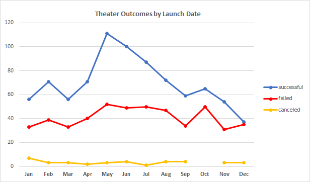
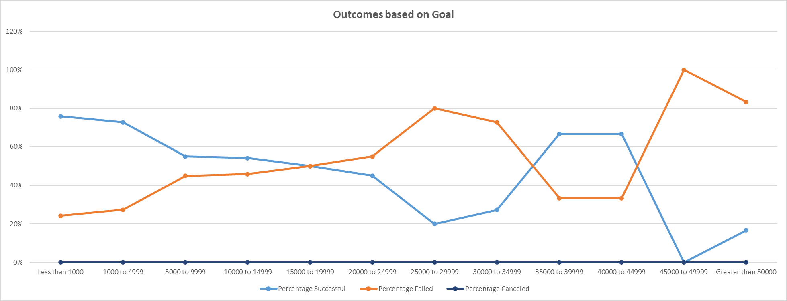

# Kickstarting with Excel

## Overview of Project

The customer, Louise, used Kickstarter, a crowdfunding platform, to raise money for her theatrical play Fever campaign. Within a short period of time, the campaign has come close to the initial fundraising goal. However, Louise would like to conduct additional benchmark analyses on the fundraising performance of other theatrical play campaigns. 

### Purpose

The purpose of the analysis to understand how other campaigns performed in the context of their *launch dates* and their *funding goal* amounts.

## Analysis and Challenges

To conduct the analysis, we used the Kickstarter data set that included 4,113 fundraising campaigns between 2009 and 2017. The Dataset source is [here.](https://2u-data-curriculum-team.s3.amazonaws.com/dataviz-online/module_1/data-1-1-3-StarterBook.xlsx) 

The analysis has been performed in MS Excel 2019. 

### Analysis of Outcomes Based on Launch Date

The analysis included the following steps:

1.	Added a *Date Created Conversion* field to the spreadsheet to convert the Unix date format into Excel date for the campaign *creation date*. This has been done with the following formula:  **Excel Date = ((UNIX Date/60)/60)/24 + DATE(1970,1,1)** 
2.	Added *Month* and *Year* fields to the sheet using the **Month()** and **Year()** functions in Excel
3.	Enriched the data set with *Parent Category* and with *Subcategory* Fields by splitting the field *Category and Subcategory* in the original dataset.
4.	Created a pivot table with a breakdown of the outcomes by campaign start month filtered by the *Parent category* = **Theater** and by *Year*
5.	Created a line chart showing the dynamics of *Play* campaign outcomes by the campaign *start date*

### Analysis of Outcomes Based on Goals

Based on the data set enriched at the Analysis of Outcomes Based on Launch Date, the analysis included the following steps:

1.	Created a table with the following fields: *number* and *% of successful*, *failed*, and *canceled* *Play* campaigns broken down by the *Goal* amount intervals.
2.	Populated the table using the **COUNTIFS()** formula.
3.	Created a line chart showing the dynamics of *Play* campaign outcomes by the campaign *Goal* amount  

### Challenges and Difficulties Encountered
 
The following challenges may be experienced while performing the analyses:

-	UNIX date format in the original dataset needs to be converted into the Excel date format
-	Data enrichment is necessary to parse the data points needed for the analysis, such as *Month*, *Year*, *Parent category*, and *Subcategory*
-	The **COUNTIFS()** function needs to be applied for the Analysis of Outcomes Based on Goals
-	*Hiding All Field* Buttons is needed in the Analysis of Outcomes Based on Launch Date Pivot Chart to meet the requirements. 

## Results

- What are two conclusions you can draw about the Outcomes based on Launch Date?

    **1.	The Theater campaigns follow the trend: there is a high percent of successful campaigns with the start date in May, June, and July.  The ratio of successful-outcome campaigns drops to its lowest point in December.**
    
    **2.	The Theater campaigns overall are predominantly successful: in any particular month, the number of successful campaigns is higher than the number of failed campaigns.**

- What can you conclude about the Outcomes based on Goals?

    **The majority of successful campaigns are the campaigns with _Goals_ under $20,000. The highest success rate (above 70%) is for the campaigns with _Goals_ under $5,000**

- What are some limitations of this dataset?

    The dataset has certain limitations, as follows. 

    1.	There are too few factors that describe the campaign details, such as the *Goal*, *Start Date* and *End Date*, and *Pledged* Amount. 
    2.	The data set does not contain data points on which types of sponsors contributed to the campaigns, which ways to reach out to the sponsors were used, and how the fundraising was progressing over the course of each campaign (e.g. 50% of the pledge was collected during first 14 days, 30% - over following 28 days, and the remaining 20% until the end of the campaign).

- What are some other possible tables and/or graphs that we could create?

    1.	Average amount pledged by a sponsor for successful and failed campaigns
    2.	Campaign analysis by country (*success* rate, *goal* amount, *pledge* amount, *Dates*, etc)
    3.	Factoring the *Spotlight* into the analysis – by *Subcategory*
    4.	Analysis and trends of the success factors by *Year* 
    5.	Correlation analysis of each leading factor (*month started*, *goal* amount, etc) to the outcome of the campaign

